# VideoUpgrader


VideoUpgrader is a Windows-first desktop app for evaluating video upscalers the way enthusiasts, researchers, and developers actually use them: by comparing outputs side by side, zooming into problem areas, checking framing behavior, boosting frame rate when needed, and then exporting a full processed video when a model and setting combination earns it.

The project combines a Tauri desktop shell, a React comparison-first UI, and a Python worker that handles probing, synthetic benchmark generation, model execution, interpolation, encode, remux, and diagnostic benchmarking.

## What's New

Updated April 12, 2026.

- The detached comparison window now keeps the Source reference and all blind-comparison players frame-synced in real desktop validation, so you can inspect the same logical frame instead of guessing whether offsets are coming from the tool.
- The comparison Source pane now uses a valid full-length playable reference instead of falling back to a short browser clip, which removes the black-source and wrong-timestamp failures that made blind comparisons untrustworthy.
- Comparison controls are now clearer during review: `Shift + wheel` resizes the comparison panes, `Ctrl + wheel` zooms the video content in sync across players, and drag pans the crop only after a real drag starts.
- The comparison workflow was validated with deterministic AV-sync fixtures and the desktop smoke harness, which matters because it proves the separate comparison window is doing the same job in the native app that it appears to do in the browser tests.

## What VideoUpgrader Does

- Load a local video and inspect source metadata.
- Run multiple upscale jobs against the same source material.
- Run interpolation-only jobs on an existing source video.
- Run a combined pipeline that upscales first and then interpolates to a target frame rate.
- Compare outputs with a zoomed inspection workflow.
- Run blind sample comparisons before committing to a final export.
- Generate reproducible synthetic benchmark fixtures.
- Benchmark backend and runtime combinations directly from the worker.
- Preserve full-length video output and reattach original audio during export workflows.

The current UI already includes a comparison inspector with zoom, focus presets, blind-sample selection, and external opening for full-size playback.

## Current Focus

VideoUpgrader is currently centered on:

- Real-ESRGAN-family and PyTorch image super-resolution model evaluation.
- RIFE-based frame interpolation to 30 fps or 60 fps.
- 4K framing workflows.
- Comparison-centric desktop usage instead of a one-click demo flow.
- Repeatable benchmarking so quality and speed decisions are evidence-based.

The current product direction is quality first, performance second.

## Current Processing Modes

The app now supports three distinct video processing modes:

- Upscale only.
- Interpolate only.
- Upscale first, then interpolate in the same pipeline.

Interpolation targets currently support 30 fps and 60 fps outputs through the Windows RIFE NCNN runtime.

## Job Controls

Active upscale and source-conversion jobs now support in-session pause, resume, and stop controls.

- `Pause` must halt active processing without discarding the current live job record.
- `Resume` must continue the same in-memory job when the desktop app is still running.
- `Stop` must cancel the active job and keep its saved settings available for a later restart.
- `Load Template` must restore any replayable historical run into the form so the user can adjust settings before starting a new run.
- `Restart` must reload a stopped pipeline job from its saved settings and immediately queue a fresh run from the beginning.
- Paused jobs are session-local. If the app exits while a job is paused, that run should fall back to the existing historical restart path rather than pretending it can live-resume after restart.
- Live progress and the Jobs workspace must show `paused` as a first-class state.

In practice, the action model is:

- `Resume` = continue the same in-memory job.
- `Restart` = rerun the saved request immediately from the beginning.
- `Load Template` = restore the saved request into the editor without starting it.

For new high-performance backends, the repo policy is CUDA-first on the detected NVIDIA workstation GPU whenever that execution path exists. Backends must either honor the selected GPU explicitly or surface a clear setup/fallback message rather than quietly dropping to a weaker path.

The Python worker pause path depends on `psutil` for suspending active subprocess trees during long ffmpeg or NCNN stages.

## Available Models

### Runnable Now

- `realesrgan-x4plus`: Real-ESRGAN x4 Plus via NCNN Vulkan.
- `realesrnet-x4plus`: Real-ESRNet x4 Plus via PyTorch.
- `bsrgan-x4`: BSRGAN x4 via PyTorch.
- `swinir-realworld-x4`: SwinIR Real-World x4 via PyTorch.
- `rvrt-x4`: RVRT x4 via an external video-SR runner configured through `UPSCALER_RVRT_COMMAND`.
- `realesrgan-x4plus-anime`: compatibility model.
- `realesr-animevideov3-x4`: compatibility model.

### Cataloged But Not Yet Runnable In The Current App Build

- `hat-realhat-gan-x4`

### Backend Types

- `realesrgan-ncnn`: portable NCNN Vulkan backend.
- `pytorch-image-sr`: PyTorch frame-by-frame image SR backend.
- `pytorch-video-sr`: research video-SR backend driven by an external command contract.

## Desktop Workflow

The intended workflow is:

1. Select a local source video.
2. Inspect source metadata and preview.
3. Choose a model and output framing mode.
4. Run one or more upscale jobs.
5. Compare outputs with zoomed inspection and blind samples.
6. Export the winning result.

The app is designed to support model-vs-model and settings-vs-settings evaluation on the same source material, not just single-pass transcoding.

## Interface Tour

### Main Workspace

The top of the main workspace keeps the source preview, framing, and core run controls in one place.

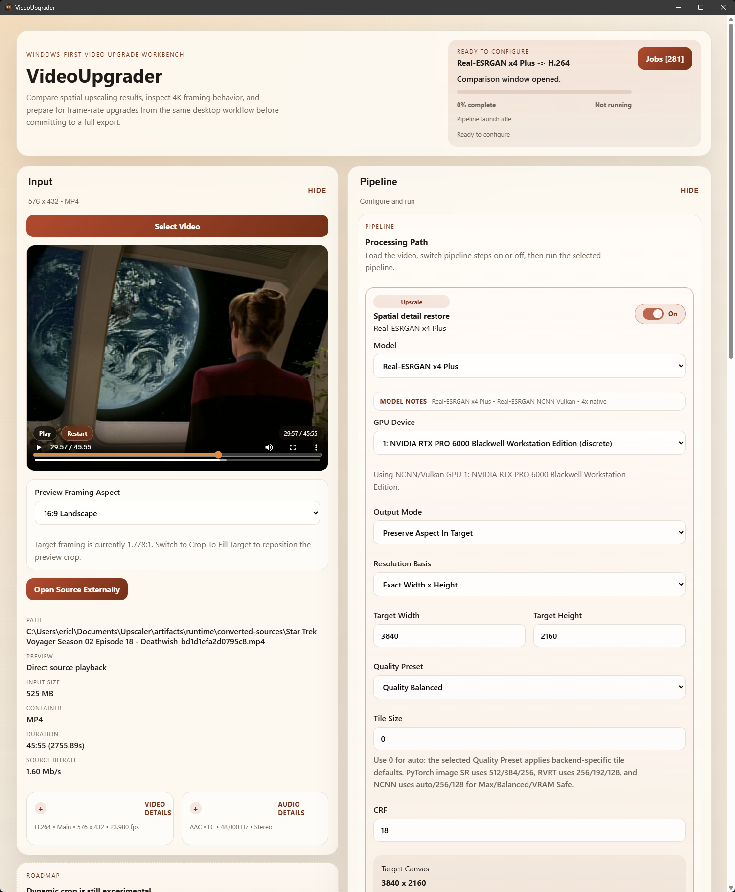

Blind comparison setup lives directly in the main page so you can capture a preview start offset, choose candidate models, and launch anonymized samples without leaving the run configuration flow.

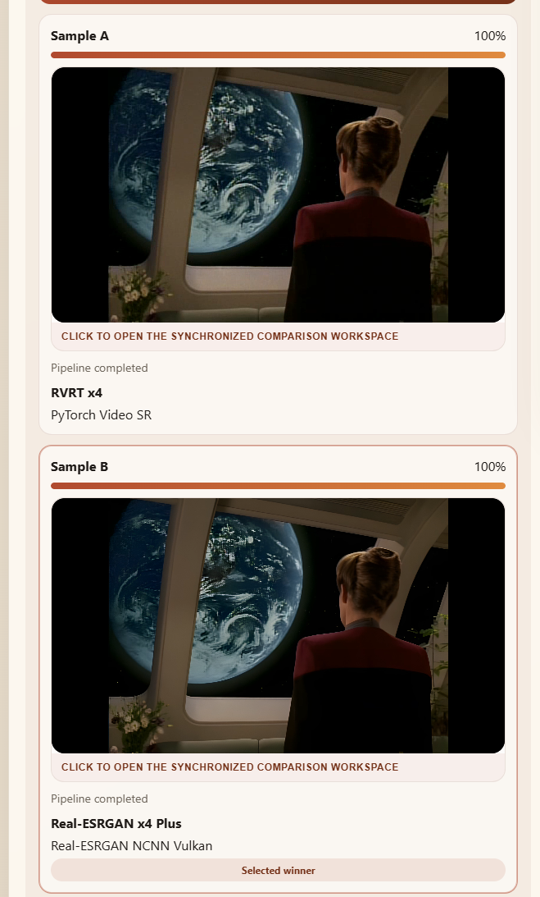

The blind-test box is where you set the one-second or multi-second sample workflow, capture the source position, and open the synchronized comparison workspace.

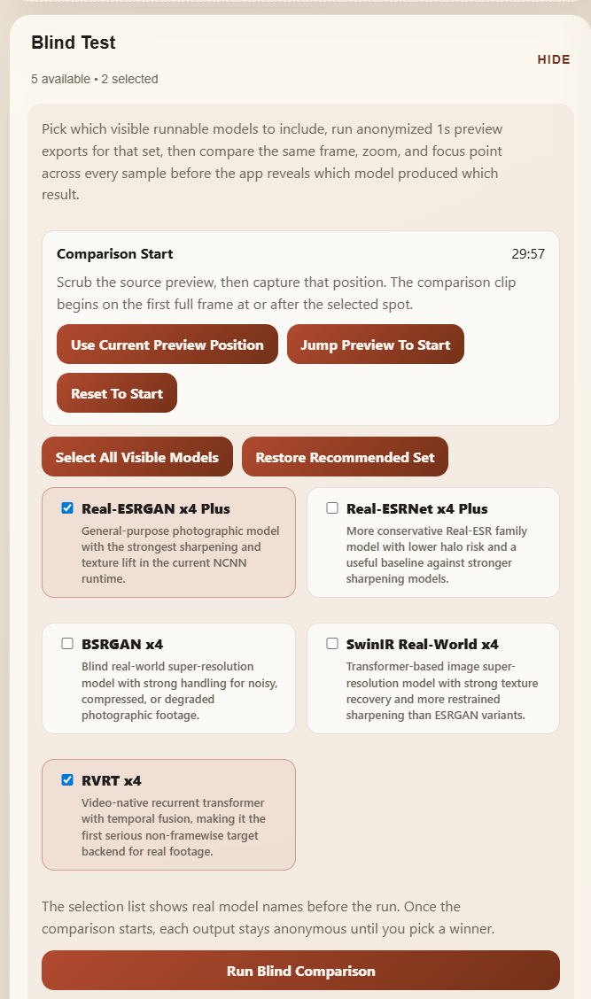

### Model And Pipeline Controls

The right-hand model selector is where you choose among runnable upscale models and switch between evaluation targets quickly.

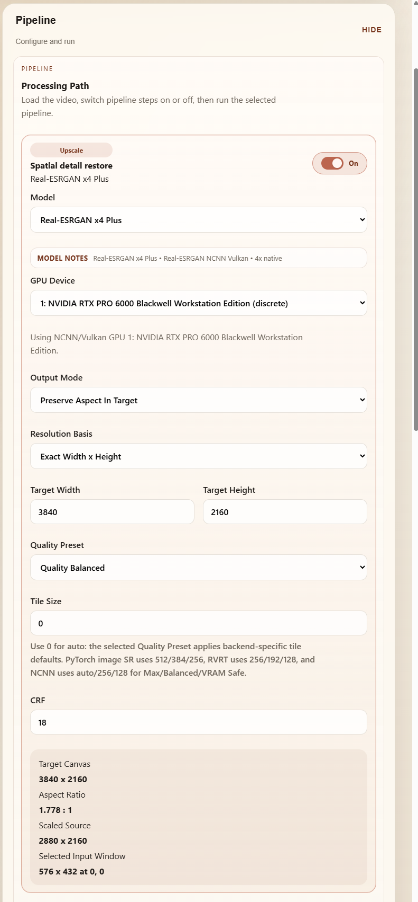

The encoder and interpolation controls sit beside the model controls so output codec, container, and frame-rate boost decisions stay visible while you configure a run.

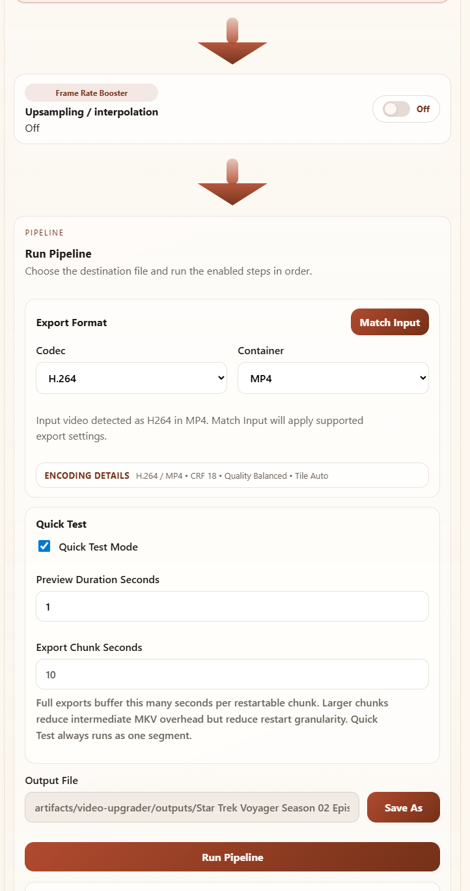

### Jobs And Comparison

The Jobs page gives you a compact queue and history view for pipeline runs, source conversions, and replayable templates.

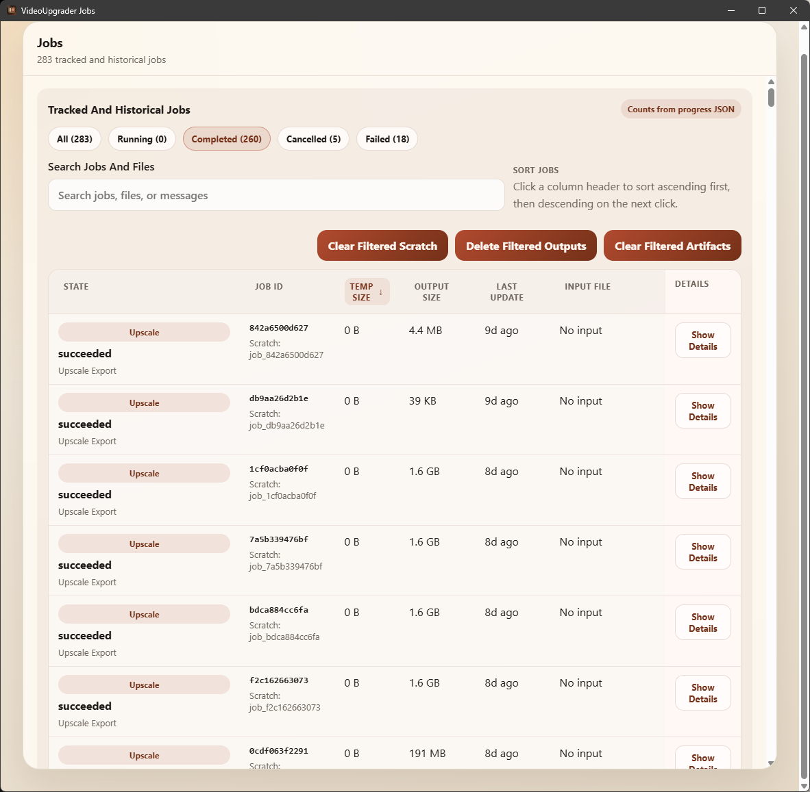

The job details page exposes the stored request, progress state, and replay actions needed to restart or reload a run without rebuilding the settings by hand.

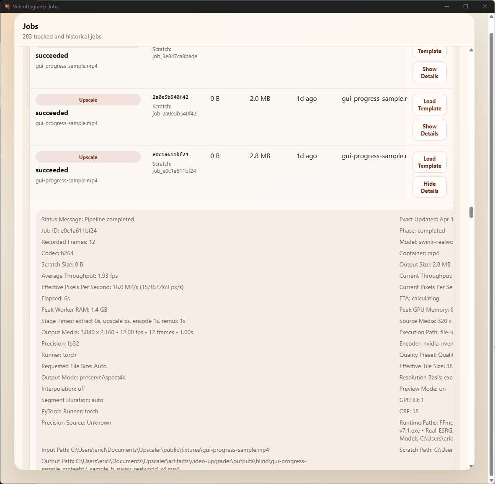

The detached comparison workspace is the core review surface for blind testing: the Source pane and every sample pane stay synchronized while you resize panes, zoom content, and pan around artifacts.

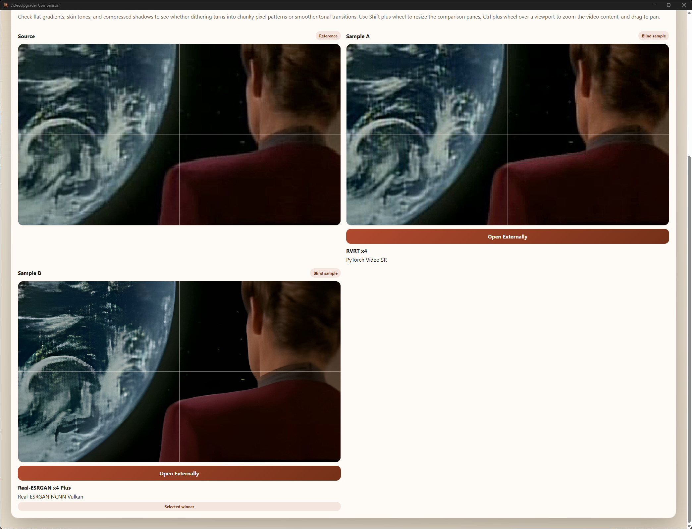

## Output Showcase

These reference stills in `docs/images/showcase` show the kind of before-and-after material the app is meant to inspect and export.

Source frame example:


Upscaled output example:


Upscaled plus interpolated output example:


Probe frame at `00:02:00.000`:

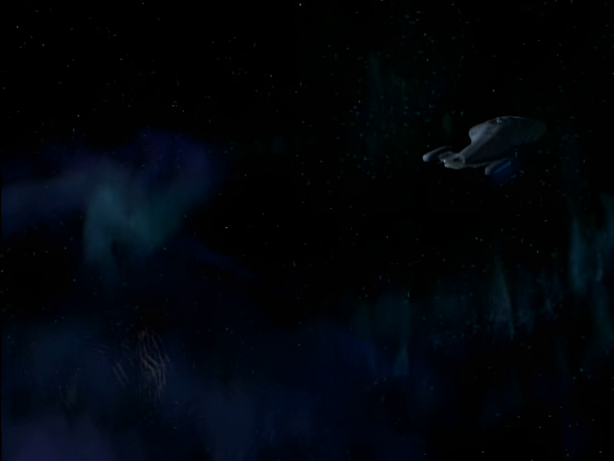

Probe frame at `00:02:30.000`:

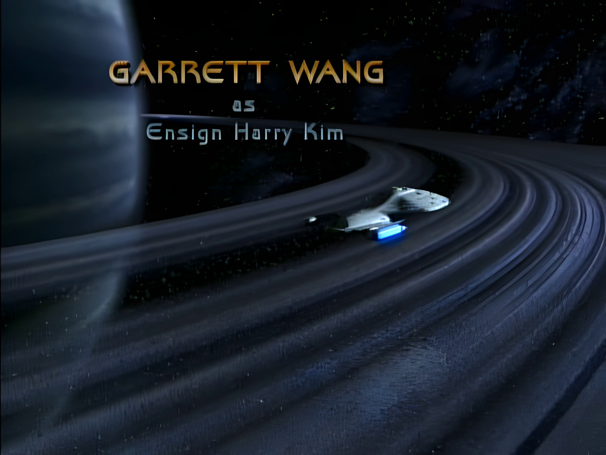

Probe frame at `00:03:00.000`:

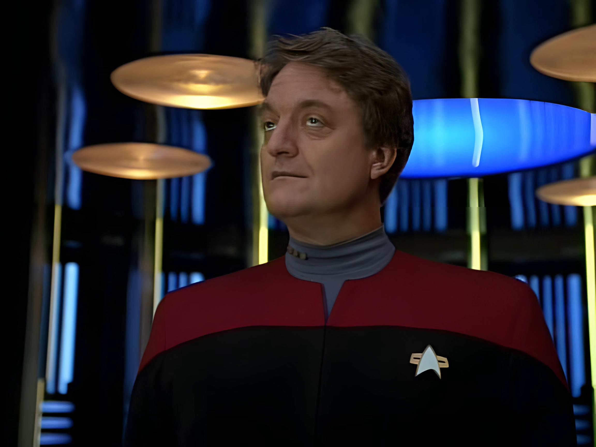

Probe frame at `00:03:30.000`:

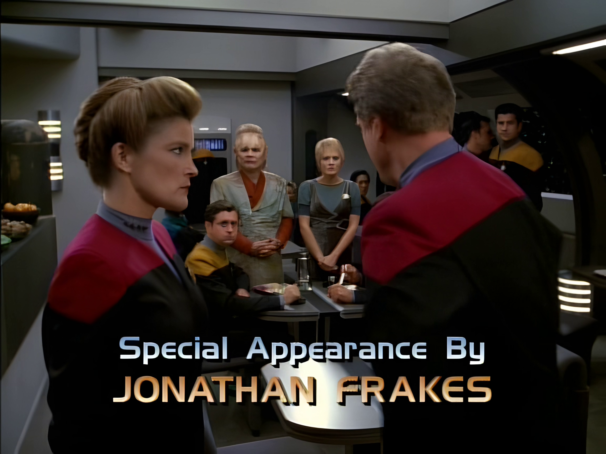

## Upscale And Interpolation Instructions

### Desktop App

Launch the desktop app:

```powershell
./scripts/run.ps1
```

Then use one of these workflows:

1. Upscale only

- Select a source video.
- In the Upscaler section, choose the upscale model you want.
- Set Frame Rate Booster to Off.
- Choose output sizing, codec, container, GPU, and quality settings.
- Click Run Upscale.

2. Interpolate an existing video without upscaling

- Select a source video.
- In Frame Rate Booster, choose Interpolate Existing Video.
- Choose the target frame rate: 30 fps or 60 fps.
- Set output codec, container, and GPU.
- Click Run Interpolation.

3. Run the combined VideoUpgrader pipeline

- Select a source video.
- Choose the upscale model and output sizing settings.
- In Frame Rate Booster, choose Interpolate After Upscale.
- Choose the target frame rate: 30 fps or 60 fps.
- Click Run Upscale + Interpolation.

Notes:

- If the source is already at or above the selected target frame rate, the app warns before continuing.
- Interpolation keeps the original audio track attached to the final export.
- The result panel includes interpolation diagnostics in a collapsed details box for segment count, overlap, source fps, and output fps.

### Python Worker CLI

Set the worker path first:

```powershell
$env:UPSCALER_PYTHON = (Resolve-Path .\.venv\Scripts\python.exe).Path
$env:PYTHONPATH='python'
```

1. Run upscale only

```powershell
& $env:UPSCALER_PYTHON python/upscaler_worker/cli.py run-realesrgan-pipeline --source input.mp4 --model-id realesrgan-x4plus --output-mode preserveAspect4k --preset qualityBalanced --interpolation-mode off --aspect-ratio-preset 16:9 --resolution-basis exact --target-width 3840 --target-height 2160 --output-path artifacts/output/upscaled-only.mp4 --codec h264 --container mp4
```

2. Run interpolation only

```powershell
& $env:UPSCALER_PYTHON python/upscaler_worker/cli.py run-realesrgan-pipeline --source input.mp4 --model-id realesrgan-x4plus --output-mode preserveAspect4k --preset qualityBalanced --interpolation-mode interpolateOnly --interpolation-target-fps 60 --aspect-ratio-preset 16:9 --resolution-basis exact --target-width 3840 --target-height 2160 --output-path artifacts/output/interpolated-only.mp4 --codec h264 --container mp4
```

3. Run upscale and interpolation together

```powershell
& $env:UPSCALER_PYTHON python/upscaler_worker/cli.py run-realesrgan-pipeline --source input.mp4 --model-id realesrgan-x4plus --output-mode preserveAspect4k --preset qualityBalanced --interpolation-mode afterUpscale --interpolation-target-fps 60 --aspect-ratio-preset 16:9 --resolution-basis exact --target-width 3840 --target-height 2160 --output-path artifacts/output/upscaled-and-interpolated.mp4 --codec h264 --container mp4
```

CLI notes:

- `--interpolation-mode off` means upscale only.
- `--interpolation-mode interpolateOnly` skips the upscale stage and runs interpolation on the source video.
- `--interpolation-mode afterUpscale` runs interpolation after the upscale stage completes.
- The worker lazily downloads the RIFE runtime the first time an interpolation job runs.
- Add `--gpu-id`, `--tile-size`, `--precision`, or `--pytorch-runner` if you need to pin a device or tune runtime behavior.

## Prerequisites

- Windows
- `winget` available through App Installer on a current Windows install

`bootstrap.ps1` is now the intended soup-to-nuts setup path. It will install any missing local workstation dependencies it needs for this repo, including:

- Node.js LTS
- Python 3.10
- Rust and Cargo
- Microsoft C++ Build Tools with the Desktop C++ workload
- Microsoft Edge WebView2 Runtime

Preferred Python environment variable:

```powershell
$env:UPSCALER_PYTHON = (Resolve-Path .\.venv\Scripts\python.exe).Path
```

If that variable is not set, the repository scripts prefer the repo-local `.venv` and only fall back to `python` when needed.

## One-Time Setup

```powershell
./scripts/bootstrap.ps1
```

`bootstrap.ps1` now performs the full local deploy path for a fresh clone:

- installs missing Windows toolchains and runtimes through `winget`
- creates the repo-local `.venv` when needed
- installs npm and Python dependencies
- installs the pinned CUDA PyTorch runtime
- builds the web and desktop host
- pre-downloads the current runtime packages and runnable model weights, including the built-in RVRT repo and Vimeo x4 checkpoint

After bootstrap completes, the first app launch should not need to stop for model or runtime downloads.

## Standard Commands

Run tests:

```powershell
./scripts/test.ps1
```

Build frontend and desktop host checks:

```powershell
./scripts/build.ps1
```

Build and run tests in the same step:

```powershell
./scripts/build.ps1 -RunTests
```

Launch the desktop app:

```powershell
./scripts/run.ps1
```

Generate synthetic benchmark fixtures:

```powershell
./scripts/generate-benchmarks.ps1
```

Run the automated desktop smoke test:

```powershell
./scripts/desktop-test.ps1
```

## Frontend / Desktop Dev Commands

These are also available directly through `npm`:

```powershell
npm run dev
npm run build:web
npm run test:web
npm run test:gui
npm run tauri:dev
npm run tauri:build
```

## Benchmarking And Worker Tools

The Python worker exposes direct benchmark and diagnostic entrypoints.

Examples:

Generate a small synthetic fixture:

```powershell
$env:PYTHONPATH='python'
& $env:UPSCALER_PYTHON python/upscaler_worker/cli.py generate-benchmark --output-dir artifacts/benchmarks --name quick_fixture --frames 4 --width 1280 --height 720 --downscale-width 320 --downscale-height 180
```

Compare precision quality on a small frame set:

```powershell
$env:PYTHONPATH='python'
& $env:UPSCALER_PYTHON python/upscaler_worker/cli.py compare-precision-quality --manifest-path artifacts/benchmarks/quick_fixture/manifest.json --model-id swinir-realworld-x4 --tile-size 128 --reference-precision fp32 --candidate-precision bf16 --max-frames 4
```

Install the optional TensorRT runner dependencies:

```powershell
& $env:UPSCALER_PYTHON -m pip install -r python/requirements-tensorrt.txt
```

Benchmark SwinIR with the TensorRT runner:

```powershell
$env:PYTHONPATH='python'
& $env:UPSCALER_PYTHON python/upscaler_worker/cli.py benchmark-upscaler --manifest-path artifacts/benchmarks/quick_fixture/manifest.json --model-id swinir-realworld-x4 --tile-sizes 128 --repeats 1 --precision fp32 --pytorch-runner tensorrt
```

Benchmark the PyTorch streaming path:

```powershell
$env:PYTHONPATH='python'
& $env:UPSCALER_PYTHON python/upscaler_worker/benchmark_pytorch_pipeline_paths.py --model-id swinir-realworld-x4 --execution-paths streaming --repeats 1 --duration-seconds 10 --width 1280 --height 720 --fps 24 --tile-size 128 --preset qualityBalanced --precision bf16 --output-mode preserveAspect4k --resolution-basis exact --target-width 3840 --target-height 2160
```

RVRT now runs through the same external runner contract in both the desktop pipeline and the worker benchmarks. If the official RVRT repo is available at `tmp/RVRT`, the app will default to the built-in `upscaler_worker.rvrt_external_runner` automatically. `UPSCALER_RVRT_COMMAND` remains available as an override and can point to any command template that reads an input PNG sequence and writes an output PNG sequence. The command may use placeholders like `{input_dir}`, `{output_dir}`, `{model_id}`, `{tile_size}`, and `{frame_count}`.

Example:

```powershell
$env:PYTHONPATH='python'
$env:UPSCALER_RVRT_COMMAND='python path/to/your_rvrt_runner.py --input {input_dir} --output {output_dir} --model {model_id}'
& $env:UPSCALER_PYTHON python/upscaler_worker/cli.py benchmark-upscaler --manifest-path artifacts/benchmarks/quick_fixture/manifest.json --model-id rvrt-x4 --tile-sizes 128 --repeats 1 --precision fp32
```

On this repo, the built-in default is active when `tmp/RVRT` exists, so the desktop app and worker CLI can run RVRT without setting `UPSCALER_RVRT_COMMAND` manually.

## Runtime Notes

The current measured PyTorch worker stack on the main workstation is:

- `torch 2.11.0+cu128`
- CUDA runtime `12.8`
- cuDNN `91900`
- Triton `3.6.0`
- GPU: `NVIDIA RTX PRO 6000 Blackwell Workstation Edition`

The worker now supports:

- Explicit precision selection: `fp32`, `fp16`, `bf16`
- Selectable PyTorch runner: `torch` or `tensorrt`
- `torch.compile`
- Selectable compile mode
- Optional cudagraphs path
- Adaptive micro-batching
- Overlapped streaming decode / upscale / encode execution

The worker also enables CUDA fast-paths for this hardware:

- cuDNN benchmark
- TF32 matmul
- high float32 matmul precision

## Benchmark Snapshot

The following numbers are verified benchmark artifacts from this repository, using the 10-second SwinIR streaming proof case:

- Model: `swinir-realworld-x4`
- Execution path: `streaming`
- Input: `1280x720`, `24 fps`, `10 seconds`
- Output: `3840x2160`
- Tile size: `128`
- Preset: `qualityBalanced`

| Configuration | Throughput (fps) | Wall Time (s) | Peak GPU Memory | Notes |
| --- | ---: | ---: | ---: | --- |
| fp32 baseline | 0.293727 | 817.10 | 5.28 GB | baseline streaming result |
| fp32 + torch.compile | 0.298449 | 804.17 | 22.84 GB | small gain, very large VRAM cost |
| bf16 | 0.412037 | 582.48 | 7.24 GB | major speedup over fp32 |
| bf16 + torch.compile | 0.478656 | 501.41 | 19.53 GB | faster than bf16, expensive in VRAM |
| bf16 + torch.compile + cudagraphs | 0.522266 | 459.55 | 9.10 GB | best measured PyTorch result so far |
| TensorRT fp32, cached engine, dedicated stream | 0.544173 | 441.15 | 8.30 GB | current best measured long-run SwinIR result |

### What These Results Mean

- `bf16` is the first big win for the PyTorch SwinIR path.
- `torch.compile` on its own helps, but its VRAM cost matters.
- `bf16 + torch.compile + cudagraphs` is the strongest measured PyTorch configuration so far on this GPU.
- Cached TensorRT fp32 is now slightly faster than the best PyTorch path on the same 10-second SwinIR streaming case.
- Compile startup overhead is still real, so short clips and smoke tests can understate steady-state gains.
- TensorRT still has a large first-run engine build cost, so cold runs remain much slower than cached runs.

## Quality Snapshot

We also ran a short 4-frame fp32-vs-bf16 comparison on a synthetic fixture.

- fp32 vs bf16 average MAE: `0.894882`
- fp32 vs bf16 average RMSE: `1.507988`
- fp32 vs bf16 average PSNR: `44.567502`
- fp32 vs bf16 average SSIM: `0.999676`

The practical takeaway is that bf16 is extremely close to fp32 on the tested SwinIR sample while being materially faster.

## Artifact Paths

Benchmark artifacts live under:

```text
artifacts/benchmarks
```

Relevant benchmark outputs generated in this workspace include:

- `pytorch-pipeline-swinir-streaming-t128-10s-720p-to-4k.json`
- `pytorch-pipeline-swinir-streaming-t128-10s-720p-to-4k-compile.json`
- `pytorch-pipeline-swinir-streaming-t128-10s-720p-to-4k-bf16.json`
- `pytorch-pipeline-swinir-streaming-t128-10s-720p-to-4k-bf16-compile.json`
- `pytorch-pipeline-swinir-streaming-t128-10s-720p-to-4k-bf16-compile-cudagraphs.json`
- `swinir-precision-quality-fp32-vs-bf16-4f.json`

## Repository Layout

- `src/`: React desktop UI
- `src-tauri/`: Tauri desktop host and Rust-side command surface
- `python/`: worker runtime, benchmarking, model integration, and media pipeline code
- `scripts/`: bootstrap, build, test, and run entrypoints
- `config/`: model catalog and app configuration
- `artifacts/`: generated benchmarks, outputs, jobs, and runtime assets
- `context/`: product requirements and planning context

## Project Status

This is an actively evolving workstation-oriented app, not a finished mass-market release.

Already real:

- desktop shell
- comparison-oriented UI
- runnable model catalog
- synthetic benchmark generation
- PyTorch and NCNN worker paths
- verified benchmark and precision-comparison tooling

Still expanding:

- broader model coverage
- deeper export polish
- richer settings-vs-settings comparison workflows
- video-native temporal SR backends
- more automatic visual diagnostics and comparison outputs

## Why This Project Exists

VideoUpgrader is for people who do not want to judge an upscaler from marketing shots, one cherry-picked crop, or a single render preset. It is for repeatable evaluation, careful comparison, evidence-backed choices, and now frame-rate upgrades that can be validated the same way.